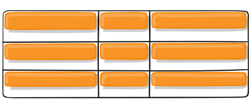
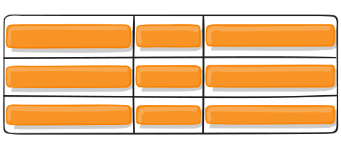

# The CSS Grid layout:

The CSS Grid Layout Module offers a grid-based layout system, with `rows` and `columns`, making it easier to design web pages without having to use floats and positioning.


# Grid Terminology:

### 1- Grid `container`:

The element on which display: grid is applied. It’s the direct parent of all the grid items.

```
<div class="container">
  <div class="item item-1"> </div>
  <div class="item item-2"> </div>
  <div class="item item-3"> </div>
</div>
```

### 2- Grid `Item`:

The children (i.e. direct descendants) of the grid container.

```
<div class="container">
  <div class="item"> </div>
  <div class="item">
    <p class="sub-item"> </p>
  </div>
  <div class="item"> </div>
</div>
```

### 3- Grid `Lines`:

The dividing lines that make up the structure of the grid. They can be either vertical (_“column grid lines”_) or horizontal (_“row grid lines”_).


### 4- Grid `Cell`:

The space between two adjacent row and two adjacent column grid lines.


### 5- Grid `Track`:

the columns or rows of the grid.


### Grid `Area`:

The total space surrounded by four grid lines. A grid area may be composed of any number of grid cells.


# Grid Properties:

### A) Properties for the Parent (Grid Container) :

1- `display` :

An HTML element becomes a grid container when its display property is set to `grid` or `inline-grid`.

```
.container {
  display: grid | inline-grid;
}
```

---

2- `grid-template-columns` / `grid-template-rows` :

- specifies the size of the columns/ rows and how many columns/ rows in a grid layout.
- it includes a space-separated list of values.

`grid-template-columns`:

### CSS syntax:

```
grid-template-columns: none|auto|max-content|min-content|(length)|initial|inherit;
```

### property values:

`none`: Default value. Columns are created if needed.

`auto`: The size of the columns is determined by the size of the container and by the size of the content of the items in the column.

`max-content`: Sets the size of each column to depend on the largest item in the column.

`min-content`: Sets the size of each column to depend on the smallest item in the column.

(_`length`_): Sets the size of the columns, by using a legal length value. (e.g. px, rem, percentage, fr).

`initial`: Sets this property to its default value.

`inherit`: Inherits this property from its parent element.

e.g.

```
.grid-container {
  display: grid;
  grid-template-columns: 30px 200px auto 100px;
}
```

If your definition contains repeating parts, you can use the repeat() notation to streamline things:

```
.container {
  grid-template-columns: repeat(3, 20px);
}
```

The `fr` unit allows you to set the size of a track as a fraction of the free space of the grid container. For example, this will set each item to one third the width of the grid container:

```
.container {
  grid-template-columns: 1fr 1fr 1fr;
}
```

The free space is calculated after any non-flexible items. In this example the total amount of free space available to the fr units doesn’t include the 50px:

```
.container {
  grid-template-columns: 1fr 50px 1fr 1fr;
}
```

`grid-template-rows`:

### CSS syntax:

```
grid-template-rows: none|auto|max-content|min-content|(length)|initial|inherit;
```

(the property values are the same as the ones above)

e.g.

```
.grid-container {
  display: grid;
  grid-template-rows: 100px 300px;
}
```

---

3- `grid-template-areas` :

Defines a grid template by referencing the names of the grid areas which are specified with the grid-area property. Repeating the name of a grid area causes the content to span those cells. A period signifies an empty cell. The syntax itself provides a visualization of the structure of the grid.

### CSS Syntax:

```
grid-template-areas: none|(itemnames);
```

`none`: Default value. No named grid areas.

_`itemnames`_: A sequence of actual names that specifies how each columns and row should display.

```
.container {
  grid-template-areas:
    "<grid-area-name> | . | none | ..."
    "...";
}
```

`<grid-area-name>` : here you write the actual name of a grid area specified with `grid-area` property.

`.` – a period signifies an empty grid cell.

example:

```
.item-a {
  grid-area: header;
}
.item-b {
  grid-area: main;
}
.item-c {
  grid-area: sidebar;
}
.item-d {
  grid-area: footer;
}

.container {
  display: grid;
  grid-template-columns: 50px 50px 50px 50px;
  grid-template-rows: auto;
  grid-template-areas:
    "header header header header"
    "main main . sidebar"
    "footer footer footer footer";
}
```

That’ll create a grid that’s four columns wide by three rows tall. The entire top row will be composed of the header area. The middle row will be composed of two main areas, one empty cell, and one sidebar area. The last row is all footer.


---

4- `grid-template`:

A shorthand for setting `grid-template-rows`, `grid-template-columns`, and `grid-template-areas` in a single declaration.

CSS syntax:

```
.container {
  grid-template: none | <grid-template-rows> / <grid-template-columns>;
}
```

`none` – sets all three properties to their initial values

`<grid-template-rows> / <grid-template-columns>` – sets grid-template-columns and grid-template-rows to the specified values, respectively, and sets grid-template-areas to none

- It also accepts a more complex but quite handy syntax for specifying all three. Here’s an example:

```
.container {
  grid-template:
     "header header header" 25px
     "footer footer footer" 25px
    / auto 50px auto;
}
```

that's equivalent to this:

```
.container {
  grid-template-rows: 25px 25px ;
  grid-template-columns: auto 50px auto;
  grid-template-areas:
    "header header header"
    "footer footer footer";
}
```

---

5-`grid-gap` :

- defines the size of the gap between the rows and columns in a grid layout,
- and is a shorthand property for the following properties:

`row-gap`,

`column-gap`

- it takes a length value (px, rem, ....)

example:

```
.container {
  grid-template-columns: 100px 50px 100px;
  grid-template-rows: 80px auto 80px;
  column-gap: 10px;
  row-gap: 15px;
}
```

or like this using the shorthand property:

```
.container {
  grid-template-columns: 100px 50px 100px;
  grid-template-rows: 80px auto 80px;
  gap: 15px 10px;
}
```

that would look like this:


The gutters are only created between the columns/rows, not on the outer edges.

---

6- `justify-items` :

- Aligns grid items along the inline (row) axis
- This value applies to all grid items inside the container.

### syntax:

```
.container {
  justify-items: start | end | center | stretch;
}
```

### values:

`start` – aligns items to be flush with the start edge of their cell

`end` – aligns items to be flush with the end edge of their cell

`center` – aligns items in the center of their cell.

`stretch` – fills the whole width of the cell (this is the default)

examples:

```
.container {
  justify-items: start;
}
```


```
.container {
  justify-items: stretch;
}
```


---

7- `align-items` :

- Aligns grid items along the block (column) axis.

- This value applies to all grid items inside the container.

### syntax:

```
.container {
  align-items: start | end | center | stretch;
}
```

### values:

`stretch` – fills the whole height of the cell (this is the default)

`start` – aligns items to be flush with the start edge of their cell

`end` – aligns items to be flush with the end edge of their cell

`center` – aligns items in the center of their cell

### examples:

```
.container {
  align-items: start;
}
```



```
.container {
  align-items: center;
}
```



```
.container {
  align-items: stretch;
}
```


-This behavior can also be set on individual grid items via the `align-self` property.

---

8- `place-items` :

- place-items sets both the align-items and justify-items properties in a single declaration.
- it can take two values (the first one sets `align-items` and the second one sets `justify-items`)
- If the second value is omitted, the first value is assigned to both properties.

```
.container {
    display: grid;
    place-items: center;
}
```

---

9- `justify-content` :

- Sometimes the total size of your grid might be less than the size of its grid container.
  This could happen if all of your grid items are sized with non-flexible units like px. In this case you can set the `alignment` of the grid within the grid container.
- This property aligns the grid along the inline (row) axis.

### syntax:

```
.container {
  justify-content: start | end | center | stretch | space-around | space-between | space-evenly;
}
```

### values:

`start` – aligns the grid to be flush with the start edge of the grid container

`end` – aligns the grid to be flush with the end edge of the grid container

`center` – aligns the grid in the center of the grid container

`stretch` – resizes the grid items to allow the grid to fill the full width of the grid container

`space-around` – places an even amount of space between each grid item, with half-sized spaces on the far ends

`space-between` – places an even amount of space between each grid item, with no space at the far ends

`space-evenly` – places an even amount of space between each grid item, including the far ends

### Examples:

```
.container {
  justify-content: start;
}
```


```
.container {
  justify-content: space-around;
}
```


```
.container {
  justify-content: space-between;
}
```


```
.container {
  justify-content: space-evenly;
}
```


---

10- `align-content` :

in the same case that the total size of your grid is less than the size of its grid container, you can set the alignment of the grid within the grid container.

- This property aligns the grid along the block (column) axis.

### syntax:

```
.container {
 align-content: start | end | center | stretch | space-around | space-between | space-evenly;
}
```

### values:

`start` – aligns the grid to be flush with the start edge of the grid container

`end` – aligns the grid to be flush with the end edge of the grid container

`center` – aligns the grid in the center of the grid container

`stretch` – resizes the grid items to allow the grid to fill the full height of the grid container

`space-around` – places an even amount of space between each grid item, with half-sized spaces on the far ends

`space-between` – places an even amount of space between each grid item, with no space at the far ends

`space-evenly` – places an even amount of space between each grid item, including the far ends

### examples:

```
.container {
  align-content: start;
}
```


```
.container {
  align-content: center;
}
```


```
.container {
  align-content: space-around;
}
```


---

11- `place-content` :

sets both the `align-content` and `justify-content` properties in a single declaration.

- it can take two values, The first value sets `align-content`, the second value `justify-content`
- If the second value is omitted, the first value is assigned to both properties.

---

## B) Properties for the Children (Grid Items) :

1- Grid lines :

```
grid-column-start
grid-column-end
grid-row-start
grid-row-end
```

- Determines a grid item’s location within the grid by referring to specific grid lines.
- `grid-column-start`/`grid-row-start` is the line where the item begins, and `grid-column-end`/`grid-row-end` is the line where the item ends.

### syntax:

```
.item {
  grid-column-start: <number> | <name> | span <number> | span <name> | auto;
  grid-column-end: <number> | <name> | span <number> | span <name> | auto;
  grid-row-start: <number> | <name> | span <number> | span <name> | auto;
  grid-row-end: <number> | <name> | span <number> | span <name> | auto;
}
```

### Values:

`<line>` – can be a number to refer to a numbered grid line, or a name to refer to a named grid line

`span <number>` – the item will span across the provided number of grid tracks

`span <name>` – the item will span across until it hits the next line with the provided name

`auto` – indicates auto-placement, an automatic span, or a default span of one

### example:

```
.item-a {
  grid-column-start: 2;
  grid-column-end: five;
  grid-row-start: row1-start;
  grid-row-end: 3;
}
```


```
.item-b {
  grid-column-start: 1;
  grid-column-end: span col4-start;
  grid-row-start: 2;
  grid-row-end: span 2;
}
```


- If no grid-column-end/grid-row-end is declared, the item will span 1 track by default.
- Items can overlap each other. You can use z-index to control their stacking order.

---

### 2) `grid-column`, `grid-row` :

- Shorthand for `grid-column-start` + `grid-column-end`, and `grid-row-start` + `grid-row-end`, respectively.

### syntax:

```.item {
  grid-column: <start-line> / <end-line> | <start-line> / span <value>;
  grid-row: <start-line> / <end-line> | <start-line> / span <value>;
}
```

### values:

- `<start-line>` / `<end-line>` – each one accepts all the same values as the longhand version, including span

### examples:

```
.item-c {
  grid-column: 3 / span 2;
  grid-row: third-line / 4;
}
```


---

### 3) `grid-area` :

- Gives an item a name so that it can be referenced by a template created with the `grid-template-areas` property.
- Alternatively, this property can be used as an even shorter shorthand for `grid-row-start` + `grid-column-start` + `grid-row-end` + `grid-column-end`.

### syntax:

```
.item {
  grid-area: <name> | <row-start> / <column-start> / <row-end> / <column-end>;
}
```

### values:

`<name>` – a name of your choosing
`<row-start>` / `<column-start>` / `<row-end>` / `<column-end>` – can be numbers or named lines

### examples:

- As a way to assign a name to the item:

```
.item-d {
  grid-area: header;
}
```

- As the short-shorthand for `grid-row-start` + `grid-column-start` + `grid-row-end` + `grid-column-end`:

```
.item-d {
  grid-area: 1 / col4-start / last-line / 6;
}
```


---

### 4) `justify-self` :

- Aligns a grid item inside a cell along the inline (row) axis (as opposed to `align-self` which aligns along the block (column) axis).
- This value applies to a grid item inside a single cell.

### syntax:

```
.item {
  justify-self: start | end | center | stretch;
}
```

### values:

`start` – aligns the grid item to be flush with the start edge of the cell

`end` – aligns the grid item to be flush with the end edge of the cell

`center` – aligns the grid item in the center of the cell

`stretch` – fills the whole width of the cell (this is the default)

### examples:

```
.item-a {
  justify-self: start;
}
```


```
.item-a {
  justify-self: stretch;
}
```


---

### 5) `align-self` :

- Aligns a grid item inside a cell along the block (column) axis (as opposed to `justify-self` which aligns along the inline (row) axis).
- This value applies to the content inside a single grid item.

### syntax:

```
.item {
  align-self: start | end | center | stretch;
}
```

### values:

`start` – aligns the grid item to be flush with the start edge of the cell

`end` – aligns the grid item to be flush with the end edge of the cell

`center` – aligns the grid item in the center of the cell

`stretch` – fills the whole height of the cell (this is the default)

### examples:

```
.item-a {
  align-self: start;
}
```


```
.item-a {
  align-self: end;
}
```


---

### 6) `place-self` :

`place-self` sets both the `align-self` and `justify-self` properties in a single declaration.

### syntax:

```
.item-a {
  place-self: center;
}
```

### values:

`auto` – The “default” alignment for the layout mode.

`<align-self>` / `<justify-self>` – The first value sets `align-self`, the second value `justify-self`. If the second value is omitted, the first value is assigned to both properties.

### examples:

```
.item-a {
  place-self: center;
}
```


```
.item-a {
  place-self: center stretch;
}
```


---

## Grid functions:

### 1) `repeat` :

The `repeat()` CSS function represents a repeated fragment of the track list, allowing a large number of columns or rows that exhibit a recurring pattern to be written in a more compact form.

- This is useful for grids with items with equal sizes or many items.
- The `repeat()` notation accepts 2 arguments: the first represents the number of times the defined tracks should repeat, and the second is the track definition.

```
grid-template-rows:    repeat(4, 100px);
grid-template-columns: repeat(3, 1fr);
```

otherwise the above example would look like this:

```
grid-template-rows:    100px 100px 100px 100px;
grid-template-columns:  1fr 1fr 1fr;
```

---

### 2) `minmax()` :

- This function means that you can set a minimum and a maximum size for a track.
- The `minmax()` function accepts 2 arguments: the first is the minimum size of the track and the second the maximum size.
- Alongside length values, the values can also be auto, which allows the track to grow/stretch based on the size of the content.

```
grid-template-rows:    minmax(100px, auto);
grid-template-columns: minmax(auto, 50%) 1fr 3em;
```

In this example, the first row track is set to have a minimum height of `100px`, but its maximum size of `auto` will allow the row track to grow it the content is taller than 100px.

The first column track has a minimum size of `auto`, but its maximum size of `50%` will prevent it from getting no wider than 50% of the grid container width.

---
