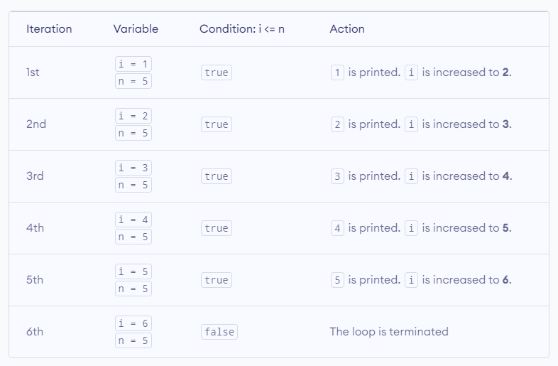
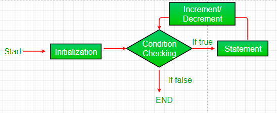
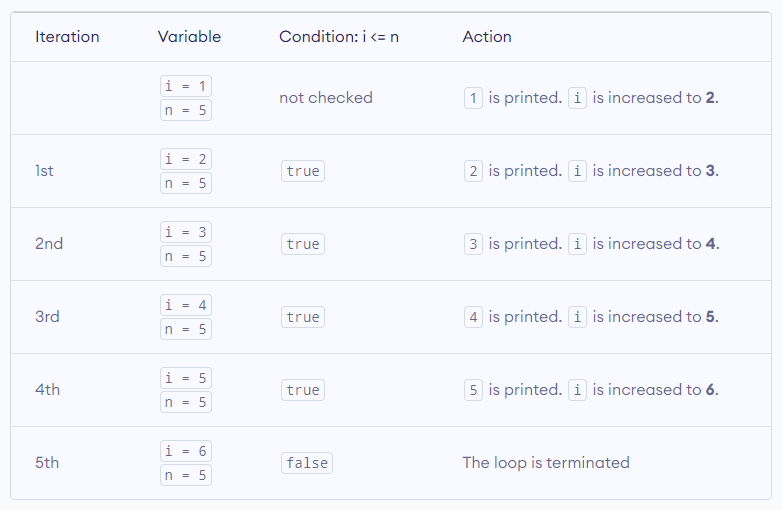

# Loops and iteration:

### Definition:

Loops offer a quick and easy way to do something repeatedly. Looping in programming languages is a feature which facilitates the execution of a set of instructions/functions repeatedly while some condition evaluates to true.

- You can think of a `loop` as a computerized version of the game where you tell someone to take `X` steps in one direction, then `Y` steps in another. For example, the idea _"Go five steps to the east"_ could be expressed this way as a loop:

```
for (let step = 0; step < 5; step++) {
  // Runs 5 times, with values of step 0 through 4.
  console.log('Walking east one step');
}
```

-There are mainly two types of loops:

**1- Entry Controlled loops** : In these types of loops, the test condition is tested before entering the loop body. For Loops and While Loops are entry-controlled loops.

**2- Exit Controlled loops** : In these types of loops the test condition is tested or evaluated at the end of the loop body. Therefore, the loop body will execute at least once, irrespective of whether the test condition is `true` or `false`. The do-while loop is exit controlled loop.

---

JavaScript mainly provides **_three ways_** for executing the loops. While all the ways provide similar basic functionality, they differ in their syntax and condition checking time:

## 1- while loop:

A `while` statement executes its statements as long as a specified condition evaluates to `true`.

- The condition test occurs before statement in the loop is executed.

A while statement looks as follows:

```
while (boolean condition)
{
   loop statements...
}
```

If the condition becomes `false`, statement within the loop stops executing and control passes to the statement following the loop.

here is how it works:


- `While` loop starts with checking the condition. If it is evaluated to be `true`, then the loop body statements are executed otherwise first statement following the loop is executed. For this reason, it is also called **_the Entry control loop_**.

- Once the condition is evaluated to be `true`, the statements in the loop body are executed. Normally the statements contain an update value for the variable being processed for the next iteration.

- When the condition becomes `false`, the loop terminates which marks the end of its life cycle.

## Example:

```
// program to display numbers from 1 to 5
// initialize the variable
let i = 1, n = 5;

// while loop from i = 1 to 5
while (i <= n) {
    console.log(i);
    i += 1;
}
```

## output:

```
1
2
3
4
5
```

Here is how this program works.



---

## 2- for loop:

`for` loop provides a concise way of writing the loop structure. Unlike a `while` loop, a `for` statement consumes the **initialization**, **condition**, and **increment/decrement** in one line thereby providing a shorter, easy-to-debug structure of looping.

A while statement looks as follows:

```
for (initialization condition; testing condition; increment/decrement)
{
    statement(s)
}
```

here is how it works:



1- **Initialization condition** : Here, we initialize the variable in use. It marks the start of a `for` loop. An already declared variable can be used or a variable can be declared, local to loop only.

2- **Testing Condition** : It is used for testing the exit condition for a loop. It must return a boolean value. It is also an **_Entry Control Loop_** as the condition is checked prior to the execution of the loop statements.

3- **Statement execution**: Once the condition is evaluated to be `true`, the statements in the loop body are executed.

4- **Increment/ Decrement**: It is used for updating the variable for the next iteration.

5- **Loop termination** : When the condition becomes `false`, the loop terminates marking the end of its life cycle.

## Example:

```
// program to display text 5 times
const n = 5;

// looping from i = 1 to 5
for (let i = 1; i <= n; i++) {
    console.log(`I love JavaScript.`);
}
```

## output:

```
I love JavaScript.
I love JavaScript.
I love JavaScript.
I love JavaScript.
I love JavaScript.
```

Here is how this program works.


---

## 3- do-while:

The `do-while` loop is similar to the `while` loop with the only difference that it checks for the condition after executing the statements, and therefore is an example of **_an Exit Control Loop_**.

A while statement looks as follows:

```
do
{
    statements..
}
while (condition);
```

here is how it works:


1- The `do-while` loop starts with the execution of the statement(s). There is no checking of any condition for the first time.

2- After the execution of the statements, and update of the variable value, the condition is checked for a `true` or `false` value. If it is evaluated to be `true`, the next iteration of the loop starts.

3- When the condition becomes `false`, the loop terminates which marks the end of its life cycle.

4- It is important to note that the `do-while` loop will execute its statements at least once before any condition is checked, and therefore is an example of **_the exit control loop_**.

## Example:

```
// program to display numbers
let i = 1;
const n = 5;

// do...while loop from 1 to 5
do {
    console.log(i);
    i++;
} while(i <= n);
```

## output:

```
1
2
3
4
5
```

Here is how this program works:



---
